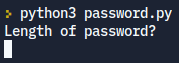

# Password-Generator
A simple password generator I created in python

To use run, enter the desired length of password and the program will randomly add numbers letters and symbols to create a unique password.

[Here is a guide on how to run a python file.](https://www.tutorialspoint.com/how-to-run-python-program)
